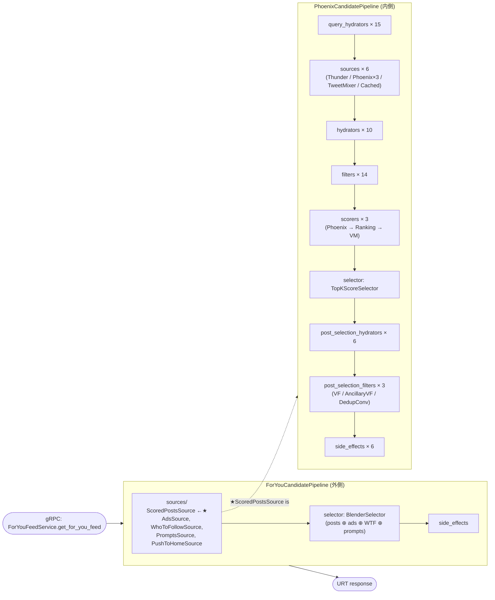
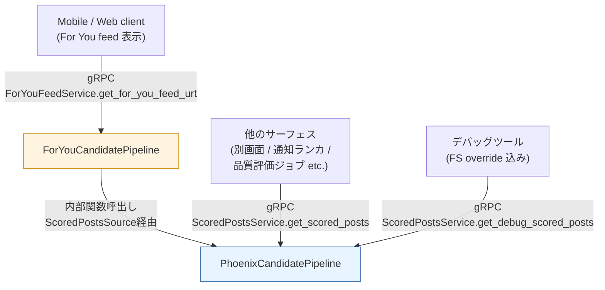
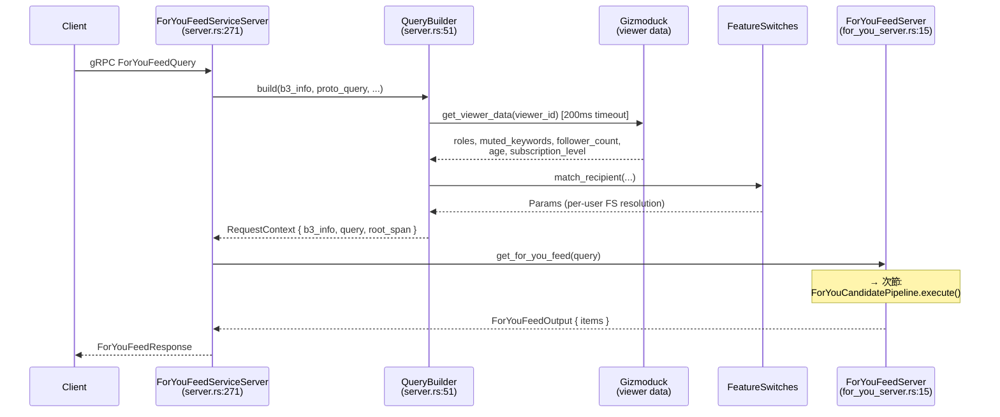
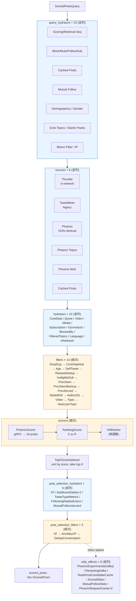

# Orchestration Flow — home-mixer の動作を追う

`home-mixer/` は For You フィードを組み立てる Rust gRPC サーバー。本ドキュメントでは「リクエストが入って Feed が返るまで」を、コード上の関数呼び出しレベルで追う。

前提となる全体像は [`00_overview.md`](./00_overview.md) を参照。

---

## 0. 1行サマリ

**home-mixer は "二段重ねの CandidatePipeline" で動いている。** 外側がフィード組み立て（投稿 + 広告 + WTF + プロンプト）、内側が純粋なレコメンド（Phoenix）。両者は同じ `CandidatePipeline` trait を実装し、外側の `Source` の1つが内側のパイプラインを呼ぶ。



★ = 内側パイプラインを呼ぶ場所 (`home-mixer/sources/scored_posts_source.rs`)

---

## 1. 二つのパイプラインの役割の違い

「`PhoenixCandidatePipeline` と `ForYouCandidatePipeline` の責務がどう分かれているのか」が、二段構造を理解する上でのカギ。

### 1.1 一文で

- **Phoenix (内側) = "レコメンドエンジン"** — 「このユーザーに見せるべき**投稿**のランク付きリストは何か？」
- **ForYou (外側) = "フィード組み立てロジック"** — 「画面に並ぶ**最終フィード**はどう構成するか？」(投稿 + 広告 + WTF + プロンプト + Push to Home)

Phoenix は「投稿のランキング」だけが仕事。ForYou は「Phoenix の結果と、他のソースを混ぜて最終 UI にする」のが仕事。

### 1.2 比較表

| 観点 | Phoenix (内側) | ForYou (外側) |
|---|---|---|
| **関心事** | 投稿の関連性スコアリング | 異種要素のブレンディング |
| **候補型** | `PostCandidate` (投稿だけ) | `FeedItem` = `Post \| Ad \| WhoToFollow \| Prompt \| PushToHome` の oneof |
| **入力** | `ScoredPostsQuery` | `ScoredPostsQuery` (同一型) |
| **出力** | `Vec<ScoredPost>` (スコア降順) | `Vec<FeedItem>` (ブレンド済み、表示順) |
| **gRPC サービス** | `ScoredPostsService` (独立呼出し可) | `ForYouFeedService` |
| **query_hydrators 数** | **15** (ID リスト群を大量に取得) | **2** (ServedHistory, PastRequestTimestamps のみ) |
| **sources 数** | **6** (Thunder, Phoenix×3, TweetMixer, Cached) | **5** (ScoredPosts★, Ads, WhoToFollow, Prompts, PushToHome) |
| **hydrators / filters / scorers / post_selection_***  | 大量 (10 / 14 / 3 / 6 + 3) | **全部 0** |
| **selector** | `TopKScoreSelector` (スコア降順 top K) | `BlenderSelector` (異種要素を混ぜる) |
| **重い処理は何か** | Phoenix transformer の gRPC 推論 | なし (Phoenix 呼出しが唯一の重い処理、それは内側にある) |
| **本質的に何をする層か** | 計算 (推論・フィルタ・ランキング) | 編集 (集約・挿入位置調整) |

★ = ScoredPostsSource が Phoenix を呼ぶブリッジ

### 1.3 具体例: あるリクエストでの中間結果

**Phoenix の出力** (内側パイプラインが返すもの):

```
[
  ScoredPost { id: 1001, score: 0.92, in_network: true,  ... },
  ScoredPost { id: 1002, score: 0.87, in_network: false, ... },
  ScoredPost { id: 1003, score: 0.83, in_network: true,  ... },
  ScoredPost { id: 1004, score: 0.79, in_network: false, ... },
  ...
]
```
→ 純粋に投稿だけ、スコア降順。

**ForYou の出力** (外側パイプラインが返すもの):

```
[
  FeedItem::Post(ScoredPost { id: 1001, ... }),      # Phoenix #1
  FeedItem::Post(ScoredPost { id: 1002, ... }),      # Phoenix #2
  FeedItem::Ad(...),                                 # AdsSource → Blender挿入
  FeedItem::Post(ScoredPost { id: 1003, ... }),      # Phoenix #3
  FeedItem::WhoToFollow(...),                        # WhoToFollowSource → 固定位置
  FeedItem::Post(ScoredPost { id: 1004, ... }),      # Phoenix #4
  FeedItem::Prompt(...),                             # PromptsSource → 固定位置
  ...
]
```
→ 投稿 + 広告 + WTF + プロンプトが混ざった最終フィード。

Phoenix は「順位付け」、ForYou は「ページレイアウト」と思うと近い。

### 1.4 なぜ2つに分けるのか — 設計判断の根拠

1. **責務の分離 (Single Responsibility)**
   レコメンドアルゴリズムの良し悪しは「投稿ランキングの的確さ」だけで測れる。広告挿入頻度や WTF 表示位置の議論をその評価に混ぜたくない。Phoenix を**純粋関数的に**保つ。

2. **Phoenix の独立利用**
   `ScoredPostsService` は別の gRPC サービスとして公開されている (`server.rs:206`)。他のサーフェス（モバイルの別画面、通知バッチ、品質評価ジョブ）が「広告抜きの純粋にランク済み投稿リスト」を欲しいときに再利用できる。

3. **A/B テストの分離**
   Phoenix の transformer モデル変更 と 広告ブレンディング戦略変更 (`safe_gap` vs `partition_organic`) を**独立に**実験できる。両方を1パイプラインに詰めていたら experiment matrix が爆発する。

4. **Trait 再利用の対称性**
   「複数ソースを集めて selector で選ぶ」という構造は、レコメンドにもフィード組み立てにも当てはまる。同じ `CandidatePipeline` trait を使えば、観測 (`#[tracing::instrument]`)、エラー処理、Feature switch ゲート (`enable()`)、並列実行、メトリクス記録が**両方に無料で適用**される。

5. **デバッグサービスの恩恵**
   `DebugScoredPostsService` は内側 Phoenix だけを叩く。「広告抜きで純粋なランキング結果を JSON ダンプしたい」というニーズに、外側を経由せず直接答えられる。

### 1.5 どこから呼ばれるか



- **ForYou** は基本的にエンドユーザーのフィード表示専用 (1経路)
- **Phoenix** は ForYou 経由 + 独立 gRPC サービスとしても利用される (多経路)

### 1.6 「外側の hydrators/filters/scorers が空」が意味するもの

`for_you_candidate_pipeline.rs:247-269` を見ると、外側パイプラインは

```rust
fn hydrators(&self)               -> &[...]  { &[] }
fn filters(&self)                 -> &[...]  { &[] }
fn scorers(&self)                 -> &[...]  { &[] }
fn post_selection_hydrators(&self)-> &[...]  { &[] }
fn post_selection_filters(&self)  -> &[...]  { &[] }
```

と全部空。これは**設計上の意図**:

| 段階 | なぜ空か |
|---|---|
| hydrators | 各 source (Phoenix / Ads / WTF / Prompts) が**自前で完全に hydrate 済みのアイテム**を返す。外側でもう一度載せ直す情報はない |
| filters | Phoenix 内側で投稿の eligibility は全て検証済み。広告は AdIndex 側で targeting 済み。WTF も WTF サービス側でランキング済み |
| scorers | Phoenix が投稿スコアを既に持っている。広告・WTF は「混ぜる位置」が問題でスコア比較する対象ではない |

つまり **外側 = "Blending 専用パイプライン"**。`CandidatePipeline` trait の8ステージのうち、`query_hydrators` / `sources` / `selector` / `side_effects` の4つだけを使う"省力モード"で動いている。

この設計の利点は「**もし将来、外側でも追加 scorer が必要になったら、空の場所に差し込むだけ**」という拡張性。例えば「広告と投稿を統合ランキングしたい」要件が来ても、外側 scorer に1つ追加すれば対応できる。

---

## 2. エントリポイント (gRPC → QueryBuilder → Server)

### 1.1 起動

`home-mixer/main.rs:42` `main()` で `XServiceBuilder` を起動。`HomeMixerServer` が3つの gRPC サービスを登録:

- `ForYouFeedService` (`get_for_you_feed`, `get_for_you_feed_urt`)
- `ScoredPostsService` (`get_scored_posts`, `get_debug_scored_posts`)

実装は `home-mixer/server.rs:206-`

### 1.2 リクエスト到着



**ポイント:**
- `viewer_id == 0` は invalid_argument で即拒否 (`server.rs:67`)
- `TEST_USER_IDS` は空フィードを即返す (`for_you_server.rs:32`)
- viewer data 取得は **200ms タイムアウト**、失敗時は `ViewerData::default()` で続行 (`server.rs:177-187`)
- `params::TRACE_USER_IDS` に入っていれば強制サンプリング (`server.rs:69`)

---

## 3. 二段パイプラインの核心

`CandidatePipeline` trait は `candidate-pipeline/candidate_pipeline.rs:67` で定義され、`execute()` の本体は同ファイル `89-137`。

### 3.1 trait のステージ順序 (固定)

```rust
// candidate-pipeline/candidate_pipeline.rs:89
async fn execute(&self, query: Q) -> PipelineResult<Q, C> {
    let hydrated_query = self.hydrate_query(query).await;
    let hydrated_query = self.hydrate_dependent_query(hydrated_query).await;
    let candidates = self.fetch_candidates(&hydrated_query).await;
    let hydrated_candidates = self.hydrate(&hydrated_query, candidates).await;
    let (kept, filtered) = self.filter(&hydrated_query, hydrated_candidates);
    let scored = self.score(&hydrated_query, kept).await;
    let SelectResult { selected, non_selected } = self.select(&hydrated_query, scored);
    let post_hydrated = self.hydrate_post_selection(&hydrated_query, selected).await;
    let (final_, post_filtered) = self.filter_post_selection(&hydrated_query, post_hydrated);
    // truncate to result_size()
    self.finalize(...);
    self.run_side_effects(input);     // tokio::spawn, fire-and-forget
    PipelineResult { ... }
}
```

このテンプレートメソッドが**両方のパイプラインで使い回される**のがキー設計。

### 3.2 並列 / 順次の使い分け

| ステージ | 実行方式 | 根拠 |
|---|---|---|
| `query_hydrators` | **並列** (`join_all`) | `candidate_pipeline.rs:206-208` |
| `sources` | **並列** (`join_all`) | `:262-263` 全 source 結果を `append` |
| `hydrators` | **並列** (`join_all`) | `:312-313` 各 hydrator が `update_all` で merge |
| `filters` | **順次** | `:365` 前 filter の出力を次 filter に渡す |
| `scorers` | **順次** | `:398-401` Phoenix → Ranking → VM の順で積み上げ |
| `selector` | (単発) | `:407-416` |
| `post_selection_hydrators` | **並列** | 同じ helper を再利用 |
| `post_selection_filters` | **順次** | 同じ helper を再利用 |
| `side_effects` | **並列 + spawn** | `:419-428` メインフローはブロックしない |

順次が必要なのは「filter の結果に依存する filter」「scorer 同士でスコアを書き換える」など状態依存があるところだけ。

### 3.3 Feature switch によるオン/オフ

各 component は `enable(&query) -> bool` を実装。`candidate_pipeline.rs:206` 等で `filter(|h| h.enable(&query))` され、無効化された component は実行されず、span に `disabled=...` として記録される。

---

## 4. 外側: ForYouCandidatePipeline

`home-mixer/candidate_pipeline/for_you_candidate_pipeline.rs`

候補型は `FeedItem` (`xai_home_mixer_proto`)。中身は `Post | Ad | WhoToFollowModule | Prompt | PushToHomePost` の oneof。

### 4.1 構成 (シンプル)

| ステージ | 構成 | 行 |
|---|---|---|
| query_hydrators | `ServedHistoryQueryHydrator`, `PastRequestTimestampsQueryHydrator` | `:155-162` |
| sources | `ScoredPostsSource` (★), `AdsSource`, `WhoToFollowSource`, `PromptsSource`, `PushToHomeSource` | `:164-177` |
| hydrators / filters / scorers / post_*  | **すべて空** | `:247-269` |
| selector | `BlenderSelector` | `:179` |
| side_effects | AdsInjectionLogging / PublishSeenIds / ServedCandidates / ClientEvents / ForYouResponseStats / UpdatePastRequestTimestamps / UpdateServedHistory / TruncateServedHistory | `:181-195` |

### 4.2 ★ ScoredPostsSource — 内側パイプラインへのブリッジ

`home-mixer/sources/scored_posts_source.rs:13-32`

```rust
async fn source(&self, query: &ScoredPostsQuery) -> Result<Vec<FeedItem>, String> {
    let output = self.scored_posts_server.run_pipeline(query.clone()).await?;
    let feed_items = output.scored_posts.into_iter()
        .map(|post| FeedItem { position: 0, item: Some(feed_item::Item::Post(post)) })
        .collect();
    Ok(feed_items)
}
```

→ `ScoredPostsServer.run_pipeline()` (`scored_posts_server.rs:41`) を呼び、内側の `PhoenixCandidatePipeline.execute()` を起動。スコア済み投稿が `FeedItem::Post` に包まれて外側のソース結果になる。

### 4.3 BlenderSelector — 異種要素を1本のフィードに

`home-mixer/selectors/blender_selector.rs:24-75`

```rust
fn select(&self, query, candidates) -> SelectResult<FeedItem> {
    let { posts, ads, wtf_modules, prompts, push_to_home } = partition_feed_items(candidates);
    let blender: &dyn AdsBlender = match query.params.get(AdsBlenderType).as_str() {
        "safe_gap" => &self.safe_gap_blender,
        _ => &self.partition_organic_blender,
    };
    let mut blended = blender.blend(posts, ads);
    insert_prompts(&mut blended, prompts);
    insert_who_to_follow(&mut blended, wtf_modules);
    pin_push_to_home(&mut blended, push_to_home);
    SelectResult { selected: blended, non_selected: ... }
}
```

要点:
- **広告ブレンディングは戦略選択可能** (`safe_gap` or `partition_organic`) ← Feature switch で切替
- **プロンプト / WTF / Push to Home の挿入位置は固定** (`PROMPTS_POSITION`, `WHO_TO_FOLLOW_POSITION`, push_to_home は pin)
- 落とされた posts/ads は `non_selected` placeholder にして side effects から参照可能に

---

## 5. 内側: PhoenixCandidatePipeline

`home-mixer/candidate_pipeline/phoenix_candidate_pipeline.rs`

候補型は `PostCandidate`。これが本来の「レコメンドアルゴリズム本体」。

### 5.1 構成全表

`build_with_clients()` (`:156-351`) の登録順そのまま:

#### query_hydrators (15個・並列)
| # | 名前 | 役割 |
|---|---|---|
| 1 | `ScoringSequenceQueryHydrator` | エンゲージメント履歴をランキング用シーケンスに |
| 2 | `RetrievalSequenceQueryHydrator` | 同じく retrieval 用 |
| 3 | `BlockedUserIdsQueryHydrator` | ブロック中ユーザー ID |
| 4 | `MutedUserIdsQueryHydrator` | ミュート中ユーザー ID |
| 5 | `FollowedUserIdsQueryHydrator` | フォロー中ユーザー ID |
| 6 | `SubscribedUserIdsQueryHydrator` | サブスク登録中 |
| 7 | `CachedPostsQueryHydrator` | Redis から前回キャッシュ取得 |
| 8 | `MutualFollowQueryHydrator` | 相互フォロー (Strato) |
| 9 | `UserDemographicsQueryHydrator` | 年齢層など |
| 10 | `FollowedGrokTopicsQueryHydrator` | フォロー中 Grok トピック |
| 11 | `FollowedStarterPacksQueryHydrator` | スターターパック |
| 12 | `InferredGrokTopicsQueryHydrator` | 推定トピック (Strato) |
| 13 | `ImpressionBloomFilterQueryHydrator` | 既読 Bloom filter |
| 14 | `IpQueryHydrator` | IP から地理情報 |
| 15 | `UserInferredGenderQueryHydrator` | 推定性別 |

#### sources (6個・並列)
| # | 名前 | 種別 |
|---|---|---|
| 1 | `ThunderSource` | **In-network** (フォロー中の最新投稿) |
| 2 | `TweetMixerSource` | Legacy リトリーバル |
| 3 | `PhoenixSource` | **Out-of-network** Phoenix retrieval |
| 4 | `PhoenixTopicsSource` | トピック由来 |
| 5 | `PhoenixMOESource` | MoE 別経路 |
| 6 | `CachedPostsSource` | 前回スコア済みキャッシュ |

#### hydrators (10個・並列)
`InNetworkCandidateHydrator`, `CoreDataCandidateHydrator`, `QuoteHydrator`, `VideoDurationCandidateHydrator`, `HasMediaHydrator`, `SubscriptionHydrator`, `GizmoduckCandidateHydrator`, `BlockedByHydrator`, `FilteredTopicsHydrator`, `LanguageCodeHydrator`

#### filters (14個・順次)
`DropDuplicates` → `CoreDataHydration` → `Age` → `SelfTweet` → `RetweetDeduplication` → `IneligibleSubscription` → `PreviouslySeenPosts` → `PreviouslySeenPostsBackup` → `PreviouslyServedPosts` → `MutedKeyword` → `AuthorSocialgraph` → `Video` → `TopicIds` → `NewUserTopicIds`

順序は意図的: 重いハイドレーションを要するチェックほど後ろに、安いチェックを先に。

#### scorers (3個・順次)
| # | 名前 | 何をする |
|---|---|---|
| 1 | `PhoenixScorer` | Phoenix gRPC を叩いて transformer に推論させ19アクション確率を取得 |
| 2 | `RankingScorer` | 確率に重みを掛けて最終スコアに集約 (`Σ wᵢ · Pᵢ`) |
| 3 | `VMRanker` | 別のリランカ (VM ranker) でさらに調整 |

#### post_selection_hydrators (6個・並列)
`VFCandidateHydrator`, `AdsBrandSafetyHydrator`, `AdsBrandSafetyVfHydrator`, `TweetTypeMetricsHydrator`, `FollowingRepliedUsersHydrator`, `MutualFollowJaccardHydrator`

選ばれた上位 K にだけ追加情報を載せる（高コスト処理を全候補に対してはやらない）。

#### post_selection_filters (3個・順次)
`VFFilter` (Visibility Filtering: 削除/スパム/violence/gore), `AncillaryVFFilter`, `DedupConversationFilter`

#### side_effects (6個・並列・fire-and-forget)
`PhoenixExperiments` (Kafka), `RerankingKafka`, `RedisPostCandidateCache`, `ScoredStats`, `MutualFollowStats`, `PhoenixRequestCache` (Redis × 2 region)

### 5.2 内側パイプラインのフロー図



---

## 6. データ型の変換チェーン

```
gRPC pb::ScoredPostsQuery
   │ QueryBuilder.build()
   ▼
ScoredPostsQuery  ─── query_hydrators が in-place で各種 ID リストを足す ───►  (hydrated)
   │
   ▼ sources
Vec<PostCandidate>  ─── hydrators / filters / scorers ───►  scored Vec<PostCandidate>
   │
   ▼ selector (TopK) + post-selection
Vec<PostCandidate>  (上位 K)
   │ candidates_to_scored_posts (scored_posts_server.rs:77)
   ▼
Vec<ScoredPost>     (gRPC proto)
   │ FeedItem に包む (ScoredPostsSource)
   ▼
Vec<FeedItem>       ─── + AdsSource / WhoToFollow / Prompts / PushToHome ───►
   │ BlenderSelector (外側 selector)
   ▼
Vec<FeedItem> (blended)
   │ urt::make_urt_timeline (for_you_server.rs:58)
   ▼
URT Thrift binary  ─→ ForYouFeedUrtResponse
```

---

## 7. 観測・トレース・タイムアウト

- **B3 trace propagation**: `extract_b3_info(request.metadata())` で取得し、レスポンスにも `inject_trace_response_header` で埋め込む (`server.rs:212, 232`)。`TRACE_USER_IDS` は強制 sample。
- **gRPC レイテンシ目標**: `#[receive_stats(latency=Bucket500To2500)]` が `server.rs:207, 236, 272, 300` についている → **500ms〜2500ms** のバケットで観測。
- **タイムアウト**:
  - Gizmoduck (viewer data): 200ms (`server.rs:33`)
  - VF SafetyLabels: 500ms, max batch 150 (`phoenix_candidate_pipeline.rs:540-541`)
  - gRPC max connection age: 300s (`main.rs:56`)
- **各ステージのタイミング**: `#[tracing::instrument]` + `log_stage_size` で `latency_ms=... size=...` を出す (`candidate_pipeline.rs:462`)。
- **filter の効率**: `removed_per_filter=[name=N, ...]` がログに出るので「どのフィルタで何件落ちたか」が見える (`:466-475`)。

---

## 8. デバッグ経路: get_debug_scored_posts

`server.rs:236-267` の `get_debug_scored_posts` は:

1. `b3_info.force_sample()` で必ずトレース採取
2. `fs_overrides` (HashMap) を受け取って **Feature switch を上書き** (`server.rs:163-172`)
3. 通常と同じ `run_pipeline` を流す
4. `build_debug_json` (`scored_posts_server.rs:115-132`) で `retrieved_candidates / filtered_candidates / selected_candidates / stats` を JSON 化して返す

→ **本番と同一コードパスで A/B 別ロジックを試せる** & **どの候補がどこで落ちたか観察可能**。

---

## 9. 読むべきファイル早見表

実装に踏み込むときの入口:

| 興味 | ファイル / 行 |
|---|---|
| gRPC ハンドラ全体 | `home-mixer/server.rs` |
| For You の組み立て (外側) | `home-mixer/candidate_pipeline/for_you_candidate_pipeline.rs` |
| レコメンドの中核 (内側) | `home-mixer/candidate_pipeline/phoenix_candidate_pipeline.rs` |
| パイプライン実行テンプレート | `candidate-pipeline/candidate_pipeline.rs:89` の `execute()` |
| Trait 定義群 | `candidate-pipeline/{source,hydrator,filter,scorer,selector,query_hydrator,side_effect}.rs` |
| BlenderSelector (広告含む組み立て) | `home-mixer/selectors/blender_selector.rs` |
| TopKScoreSelector (上位 K 選択) | `home-mixer/selectors/top_k_score_selector.rs` |
| 各 scorer の中身 | `home-mixer/scorers/{phoenix_scorer,ranking_scorer,vm_ranker,oon_scorer,weighted_scorer,author_diversity_scorer}.rs` |
| URT への変換 | `home-mixer/util/urt.rs` (推定) と `for_you_server.rs:58` |

---

## 10. 設計上の観察

1. **二段 CandidatePipeline は trait 再利用の鏡** — 同じ `execute()` を異なる候補型 (`PostCandidate` / `FeedItem`) で2回回している。外側パイプラインの hydrators/filters/scorers が空なのは、「pipeline 抽象を最後の組み立てにも使うために、敢えてフィット感は犠牲にしてでも対称性を取った」設計判断。
2. **post_selection の存在意義** — 上位 K にだけ高コスト処理 (VF, MutualFollowJaccard 等) を回すため。"早期に安いフィルタ、選別後に高価な検証" という古典的最適化。
3. **side effects は必ず spawn** — `run_side_effects` は `tokio::spawn` で fire-and-forget。レスポンスレイテンシに乗らない。失敗してもメインフローに伝播しない。
4. **「動かないなら disable する」哲学** — 各 component に `enable()` があり、Feature switch で個別にオフできる。**新機能はデフォルト disable で merge して FS で 1% → 10% → … と上げる**運用想定。
5. **モック完備** — `PhoenixCandidatePipeline::mock()` と `ForYouCandidatePipeline::mock()` がフル mock client で組まれており、E2E テストや実験が回せる。
