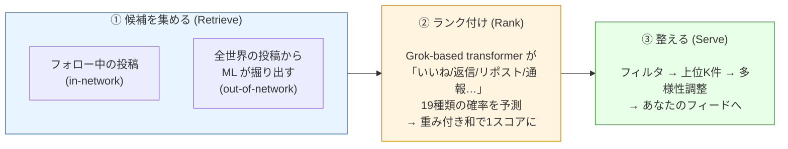
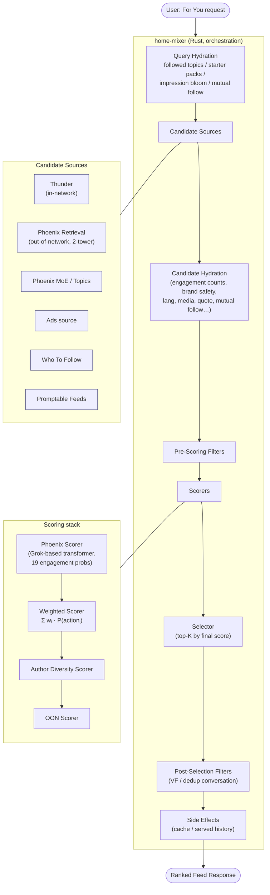
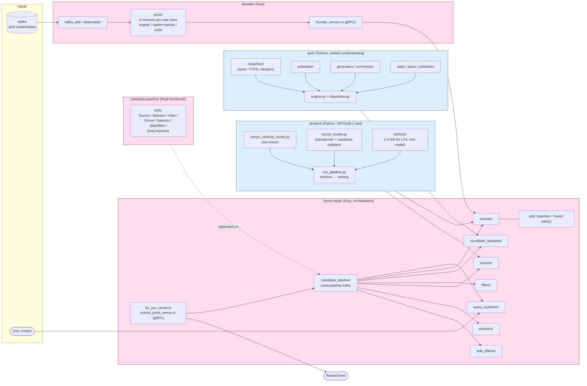
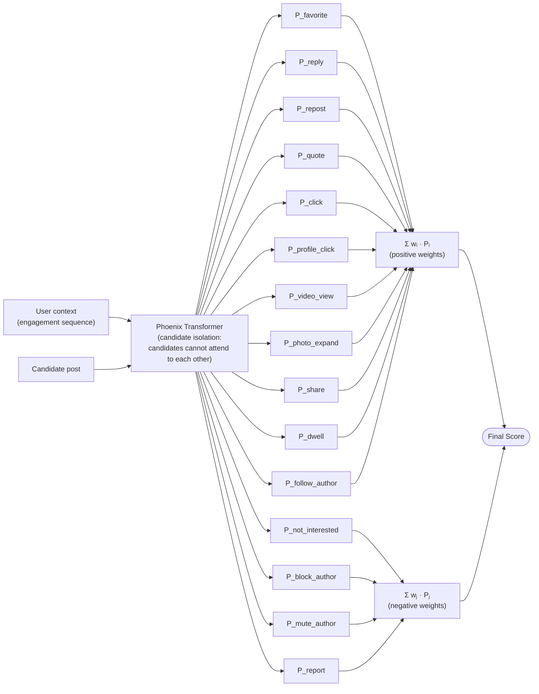

# X For You Feed Algorithm — 全体像

リポジトリ: [xai-org/x-algorithm](https://github.com/xai-org/x-algorithm)
公開: 2026年1月 / 最新アップデート: 2026年5月15日
参考記事: [OpenTweet — X Open-Sourced Its Algorithm on GitHub](https://opentweet.io/blog/x-algorithm-open-source-github-2026)

---

## 0. 30秒で掴む

**For You フィードがやっていること = 「あなたが反応しそうな投稿を集めて、並べる」** これだけ。
そのために 2つのソースから候補を集め、1つのMLモデルで全部スコアリングして、上から並べる。

**この3ステップを実現するための役者:**

| 段階 | 主な実装 | 言語 |
|---|---|---|
| ① 候補集め | `thunder/` (in-network), `phoenix/` retrieval (out-of-network) | Rust / Python |
| ② ランク付け | `phoenix/` ranking (Grok transformer) | Python |
| ③ 整える・オーケストレーション | `home-mixer/` | Rust |
| 横串の基盤 | `candidate-pipeline/` (trait 群), `grox/` (コンテンツ理解) | Rust / Python |

**設計の一行サマリ:** 手作業の特徴量を全部捨てて、ユーザーの行動履歴を transformer に食わせ、19種類のアクション確率を出させる。それを重み付き和で並べるだけ。

---

## 1. ハイレベル・データフロー

ユーザーが「For You」を開いてから、ランク済みフィードが返るまでの流れ。

---

## 2. サブシステム俯瞰

各サブシステムの「役割 / 言語 / I/O」を一目で。

---

## 3. リポジトリ・ディレクトリ対応

| ディレクトリ | 言語 | 役割 | 主要ファイル |
|---|---|---|---|
| `home-mixer/` | Rust | フィード組み立てのオーケストレーション層・gRPC エンドポイント | `for_you_server.rs`, `scored_posts_server.rs`, `candidate_pipeline/` |
| `home-mixer/ads/` | Rust | 広告挿入・ポジショニング・ブランドセーフティ | — |
| `thunder/` | Rust | In-network 投稿のインメモリストア + Kafka 取り込み | `thunder_service.rs`, `posts/`, `kafka/` |
| `phoenix/` | Python | Two-tower retrieval + Grok-based ランキング | `recsys_retrieval_model.py`, `recsys_model.py`, `run_pipeline.py`, `grok.py` |
| `phoenix/artifacts/` | (LFS) | Pre-trained mini Phoenix (256-dim, 4 heads, 2 layers, 約3GB) | — |
| `grox/` | Python | コンテンツ理解 (分類・埋め込み・スパム/PTOS) | `engine.py`, `dispatcher.py`, `classifiers/`, `embedder/` |
| `candidate-pipeline/` | Rust | パイプライン基盤 (trait 集) | `source.rs`, `hydrator.rs`, `filter.rs`, `scorer.rs`, `selector.rs`, `side_effect.rs` |

---

## 4. ランキングの核 — Phoenix のスコアリング

Phoenix の transformer は1投稿あたり **19のエンゲージメント確率** を出し、重み付き和で最終スコアにする。

**Candidate isolation** が重要設計: バッチ内の他候補に attend させないことで、スコアが「同じバッチに何が来たか」に依存せず、キャッシュ可能・一貫性ありになる。

---

## 5. 設計上のキーポイント

1. **No hand-engineered features** — 関連性に関する手作業の特徴量は全廃。transformer がエンゲージメント履歴から学習。
2. **Candidate isolation** — attention で候補同士を見えなくする。スコアの再現性とキャッシュ性。
3. **Hash-based embeddings** — retrieval / ranking 両方で複数ハッシュ関数による埋め込み参照。
4. **Multi-action prediction** — 単一の「関連性スコア」ではなく19アクションの確率を出す。ネガティブアクションは負の重み。
5. **Composable pipeline** — `candidate-pipeline` crate が trait を提供し、source/hydrator/filter/scorer の追加を容易に。並列実行と graceful error handling。
6. **Time decay** — 約6時間ごとに可視性が約50%減衰 (OpenTweet 記事より)。
7. **TweepCred** — 0〜100のレピュテーション、毎日再計算 (OpenTweet 記事より)。
8. **End-to-end runnable** — 2026-05-15 リリースで `phoenix/run_pipeline.py` により retrieval → ranking が単一エントリで動く。pre-trained mini モデル同梱。

---

## 6. 次に読むなら

- **オーケストレーションの流れ全体**を追う → [`01_orchestration_flow.md`](./01_orchestration_flow.md) (`home-mixer/` の二段パイプラインを関数呼び出しレベルで追う)
- **設計上のキーポイント**を体系的に → [`02_design_keypoints.md`](./02_design_keypoints.md) (なぜそうなっているか / 何を捨てて何を取ったか)
- **考察 (アーキテクチャから読み取れる暗黙の仮説)** → [`considerations/`](./considerations/)
  - [`01_user_representation_hypothesis.md`](./considerations/01_user_representation_hypothesis.md) — `user_hashes` は何を encode しているか、なぜプロフィール特徴量がモデル入力にないのか
- **パイプラインの抽象** → `candidate-pipeline/lib.rs` と各 trait ファイル
- **ML 本体** → `phoenix/recsys_model.py`（ランキング）, `phoenix/recsys_retrieval_model.py`（2-tower）
- **動かす** → `phoenix/run_pipeline.py` + `phoenix/artifacts/` の mini モデル
- **In-network 経路** → `thunder/thunder_service.rs` → `thunder/posts/`
