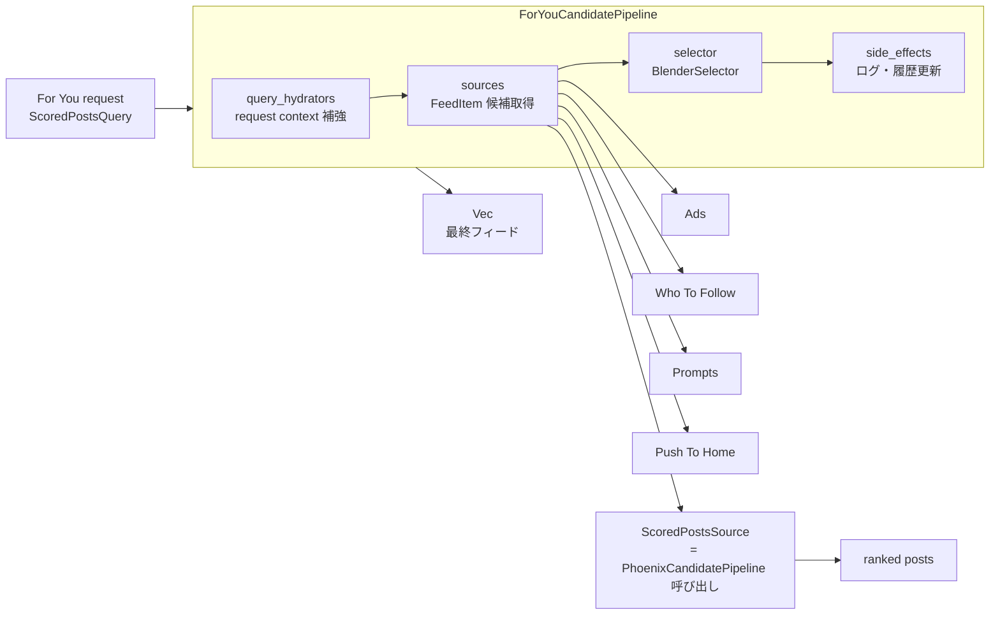

# For You Candidate Pipeline を理解する

対象コード: `external_repo/x-algorithm/home-mixer/candidate_pipeline/for_you_candidate_pipeline.rs`

---

## 0. 位置づけ

`ForYouCandidatePipeline` は、For You フィードの最終表示アイテムを組み立てる外側のパイプライン。

重要なのは、これは投稿ランキングそのものを担当するパイプラインではないこと。投稿候補の取得・フィルタ・スコアリング・Top-K 選択は内側の `PhoenixCandidatePipeline` が担当し、`ForYouCandidatePipeline` はその結果に広告、Who To Follow、Prompt、Push To Home を混ぜて `FeedItem` の列にする。



---

## 1. CandidatePipeline 共通の実行順

`ForYouCandidatePipeline` は `candidate-pipeline/candidate_pipeline.rs` の `CandidatePipeline` trait を実装している。共通フレームワークの `execute()` は、次の順番で部品を呼ぶ。

1. `query_hydrators`: query を補強する
2. `dependent_query_hydrators`: 依存関係のある query 補強を行う
3. `sources`: 候補を並列取得する
4. `hydrators`: 候補を補強する
5. `filters`: 候補を落とす
6. `scorers`: 候補にスコアを付ける
7. `selector`: 候補を選ぶ、並べる、非選択候補を分ける
8. `post_selection_hydrators`: 選択後の候補を補強する
9. `post_selection_filters`: 選択後にもう一度フィルタする
10. `side_effects`: 結果確定後の副作用を非同期実行する

ただし For You 外側パイプラインでは、`hydrators` / `filters` / `scorers` / `post_selection_*` は空。つまり実質的には次の4段だけを使う。

```text
query_hydrators -> sources -> selector -> side_effects
```

これは設計上自然で、投稿の ranking や eligibility 判定は Phoenix 側、広告や WTF の eligibility はそれぞれの外部サービス側で済んでいるため。

---

## 2. `Self { query_hydrators, sources, selector, side_effects }` の意味

`for_you_candidate_pipeline.rs` の `build()` は、外部クライアントと side effect 実装を受け取り、4種類の部品に整理して `ForYouCandidatePipeline` を作る。

| フィールド | 型 | 役割 |
|---|---|---|
| `query_hydrators` | `Vec<Box<dyn QueryHydrator<ScoredPostsQuery>>>` | 候補取得前に `ScoredPostsQuery` を補強する |
| `sources` | `Vec<Box<dyn Source<ScoredPostsQuery, FeedItem>>>` | 投稿・広告・WTF・Prompt などの `FeedItem` 候補を取得する |
| `selector` | `BlenderSelector` | 種類の違う候補を最終フィード順に混ぜる |
| `side_effects` | `Arc<Vec<Box<dyn SideEffect<ScoredPostsQuery, FeedItem>>>>` | 結果確定後にログ送信、履歴更新、統計記録を行う |

`Box<dyn ...>` はコンポーネントを trait object として同じ配列に入れるためのもの。`side_effects` が `Arc` なのは、レスポンス確定後に `tokio::spawn` で非同期実行され、所有権を task に渡す必要があるため。

---

## 3. query_hydrators

For You 外側で使う query hydrator は2つ。

| Hydrator | 追加・更新する情報 | 使われ方 |
|---|---|---|
| `ServedHistoryQueryHydrator` | 過去に表示した served history | Who To Follow の除外ユーザー、served history 更新系 side effect の前提になる |
| `PastRequestTimestampsQueryHydrator` | 非 polling request の過去時刻情報 | request 間隔の記録・更新に使われる |

query hydrator は候補取得前に並列実行され、成功した結果だけが元の `ScoredPostsQuery` に merge される。失敗してもパイプライン全体を止めるのではなく、その hydrator の更新が入らない形で続行する。

---

## 4. sources

`sources` は `FeedItem` を返す候補取得元。For You 外側では5つある。

| Source | 返す FeedItem | 役割 |
|---|---|---|
| `ScoredPostsSource` | `FeedItem::Post` | `ScoredPostsServer.run_pipeline()` を呼び、内側の `PhoenixCandidatePipeline` からランク済み投稿を取得する |
| `AdsSource` | `FeedItem::Ad` | AdIndex から eligible ads を取得する。`EnableAdsSource` が false または preview request の場合は無効 |
| `WhoToFollowSource` | `FeedItem::WhoToFollow` | Account Recommendations Mixer から WTF module を取得する。`EnableWhoToFollowModule` と `who_to_follow_eligible` が必要 |
| `PromptsSource` | `FeedItem::Prompt` | Prompts injection service から home timeline 向け prompt を取得する |
| `PushToHomeSource` | `FeedItem::PushToHome` | `push_to_home_post_id` がある場合に、指定投稿と facepile 用 replier を取得する |

`CandidatePipeline` の source stage は有効な source を並列に実行し、成功した候補配列をまとめる。ここで集まる候補はまだ「投稿、広告、WTF、Prompt などが同じ `Vec<FeedItem>` に入っただけ」の状態。

---

## 5. selector: BlenderSelector

`BlenderSelector` は For You 外側パイプラインの中心。やっていることはスコアリングではなく、異種アイテムのブレンディング。

処理の流れ:

1. `FeedItem` を `Post` / `Ad` / `WhoToFollow` / `Prompt` / `PushToHome` に分ける
2. `AdsBlenderType` param を見て広告ブレンダーを選ぶ
   - `"safe_gap"` の場合は `SafeGapAdsBlender`
   - それ以外は `PartitionOrganicAdsBlender`
3. 投稿と広告を blend する
4. Prompt を `PROMPTS_POSITION` に挿入する
5. Who To Follow を `WHO_TO_FOLLOW_POSITION` に挿入する
6. Push To Home があれば先頭に pin する
7. blend の過程で落ちた投稿・広告を `non_selected` として返す

Phoenix の `TopKScoreSelector` が「スコア順に選ぶ」selector なのに対し、For You の `BlenderSelector` は「UI 上の表示構成を作る」selector。

---

## 6. side_effects

`side_effects` は最終候補が決まった後に走る。`CandidatePipeline` 側では `selected_candidates` と `non_selected_candidates` と hydrated query を `SideEffectInput` に詰め、`tokio::spawn` 内で並列実行する。

For You 外側の side effect は次の8つ。

| SideEffect | 役割 |
|---|---|
| `AdsInjectionLoggingSideEffect` | 広告挿入結果をログ送信する |
| `PublishSeenIdsToKafkaSideEffect` | seen ids を Kafka に publish する |
| `ServedCandidatesKafkaSideEffect` | served candidate 情報を Kafka に送る |
| `ClientEventsKafkaSideEffect` | client event 用の情報を Kafka に送る |
| `ForYouResponseStatsSideEffect` | For You response の統計を記録する |
| `UpdatePastRequestTimestampsSideEffect` | request timestamp 履歴を更新する |
| `UpdateServedHistorySideEffect` | 表示済み履歴を更新する |
| `TruncateServedHistorySideEffect` | served history を適切な長さに切り詰める |

副作用なので、最終フィードの選定ロジックそのものには使われない。ログ、観測、次回リクエストのための状態更新が主目的。

---

## 7. 内側 Phoenix との境界

`ScoredPostsSource` が境界になっている。

```text
ForYouCandidatePipeline
  sources
    ScoredPostsSource
      ScoredPostsServer.run_pipeline(query.clone())
        PhoenixCandidatePipeline.execute(query)
```

Phoenix 側は `PostCandidate` を対象に、query hydration、candidate source、candidate hydration、filter、scorer、Top-K selector、post-selection filter までを行う。For You 側に返ってくる時点では、投稿は `ScoredPost` としてランク済みで、`ScoredPostsSource` がそれを `FeedItem::Post` に包む。

この分離により、Phoenix は「投稿ランキングエンジン」として独立し、For You は「画面に出すフィード編集レイヤー」として振る舞える。

---

## 8. 読むときのチェックポイント

- 投稿ランキングの詳細を追いたい場合は `ForYouCandidatePipeline` ではなく `PhoenixCandidatePipeline` を読む
- 広告や WTF がどこで混ざるかを追いたい場合は `BlenderSelector` を読む
- 「なぜこの source が動いた/動かなかったか」は各 component の `enable()` を見る
- 「次回リクエストに影響する状態」は `side_effects` と `query_hydrators` の組み合わせで見る
- `ForYouCandidatePipeline` の空の stage は未実装ではなく、外側パイプラインがブレンディング専用であることを示している

