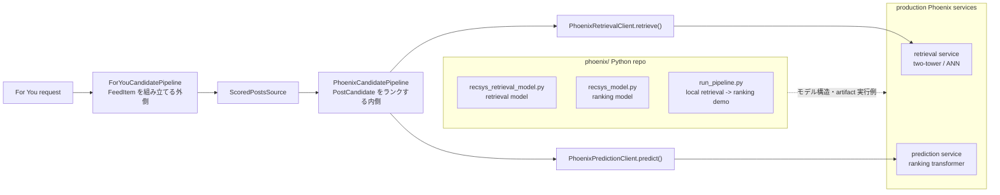

# Phoenix Pipeline と Python Phoenix の関係

対象コード:

- Rust pipeline: `external_repo/x-algorithm/home-mixer/candidate_pipeline/phoenix_candidate_pipeline.rs`
- Python model demo: `external_repo/x-algorithm/phoenix/`

---

## 0. ひとことで

`PhoenixCandidatePipeline` は **投稿候補を集め、フィルタし、Phoenix 推論サービスでスコアを取り、最終 Top-K を返す Rust のオンライン配信パイプライン**。

`phoenix/` は **Phoenix の retrieval / ranking モデルを JAX/Haiku で説明・再現する Python リポジトリ**。Rust から Python を直接 import する関係ではなく、Rust は production の Phoenix retrieval / prediction サービスを gRPC client 経由で呼ぶ。Python repo は、そのサービスの背後にあるモデル構造を理解するための実装・デモ・artifact 実行環境。



---

## 1. Rust PhoenixCandidatePipeline の構成要素

`PhoenixCandidatePipeline` は `CandidatePipeline<ScoredPostsQuery, PostCandidate>` を実装し、共通 pipeline framework の stage を次の順に埋めている。

| Stage | 主な構成要素 | 役割 |
|---|---|---|
| `query_hydrators` | `ScoringSequenceQueryHydrator`, `RetrievalSequenceQueryHydrator`, social graph, demographics, topics, bloom filter など | request にユーザー履歴・ブロック/ミュート・トピック・地理情報などを足す |
| `sources` | `ThunderSource`, `TweetMixerSource`, `PhoenixSource`, `PhoenixTopicsSource`, `PhoenixMOESource`, `CachedPostsSource` | 投稿候補を複数経路から集める。Phoenix 系 source は retrieval service を呼ぶ |
| `hydrators` | TES, Gizmoduck, quote, video, subscription, language など | 候補投稿に本文周辺情報、作者情報、会話・動画・言語などを補強する |
| `filters` | duplicate, age, self tweet, retweet dedup, served/seen, muted keyword, social graph, video, topic | 明らかに出せない候補を落とす |
| `scorers` | `PhoenixScorer` -> `RankingScorer` -> `VMRanker` | Phoenix の per-action probability を取り、重み付き最終スコアに変換し、必要なら rerank する |
| `selector` | `TopKScoreSelector` | `score` 順に最終投稿を選ぶ |
| `post_selection_hydrators` | VF, ads brand safety, tweet type metrics, mutual follow jaccard など | 上位候補にだけ高コストな追加情報を付ける |
| `post_selection_filters` | `VFFilter`, `AncillaryVFFilter`, `DedupConversationFilter` | 選定後に visibility / 会話重複を最終チェックする |
| `side_effects` | Phoenix experiments Kafka, reranking Kafka, Redis cache, stats, request cache | レスポンス確定後のログ・実験・キャッシュ更新 |

ポイントは、`PhoenixCandidatePipeline` 自体はモデル推論を実装しないこと。retrieval は `PhoenixRetrievalClient`、ranking 推論は `PhoenixPredictionClient` に委譲する。

---

## 2. Phoenix 系 source と scorer の意味

候補取得側の Phoenix は3経路ある。

| Component | 呼ぶもの | 何を返すか |
|---|---|---|
| `PhoenixSource` | `PhoenixRetrievalClient.retrieve(...)` | 通常の out-of-network 候補 |
| `PhoenixTopicsSource` | `PhoenixRetrievalClient.retrieve(...)` + topic IDs | topic request / new-user topic 用候補 |
| `PhoenixMOESource` | `PhoenixRetrievalClient.retrieve(...)` + MoE cluster | MoE 別経路の候補 |

スコアリング側は2段階。

```text
PhoenixScorer
  -> build_prediction_request(query, candidates, product_surface)
  -> PhoenixPredictionClient.predict(cluster, request)
  -> candidate.phoenix_scores = favorite/reply/retweet/dwell/... probabilities

RankingScorer
  -> Σ weight_i * phoenix_score_i
  -> author diversity / OON weight / normalize
  -> candidate.score
```

つまり Phoenix モデルは「最終スコア1個」ではなく、favorite, reply, retweet, click, dwell, not_interested, report などの複数アクション確率を出す。Rust の `RankingScorer` が product policy / feature switch の重みで配信用スコアに集約する。

---

## 3. Python phoenix/ は何を表すか

`phoenix/` は production pipeline そのものではなく、Phoenix モデルの中身を読むための Python 実装。

| Python file | 役割 | Rust pipeline との対応 |
|---|---|---|
| `recsys_retrieval_model.py` | two-tower retrieval。user/history から user embedding を作り、candidate corpus と dot product / top-K | `PhoenixRetrievalClient.retrieve(...)` の背後にある retrieval model の概念 |
| `recsys_model.py` | ranking transformer。user/history/candidates から candidate ごとの action logits を出す | `PhoenixPredictionClient.predict(...)` の背後にある ranker model の概念 |
| `run_pipeline.py` | exported artifacts を読み、retrieval -> ranking をローカルで通す end-to-end demo | Rust pipeline の Phoenix 部分を最小構成で再現する説明用 entrypoint |
| `artifacts/` | mini checkpoint, embedding tables, sports corpus, example sequence | production ではなく公開デモ用の固定 artifact |

Python の `run_pipeline.py` がやることは、Rust pipeline の Phoenix 部分と対応している。

```text
Python run_pipeline.py
  1. example_sequence.json から user history を読む
  2. retrieval model で user representation を作る
  3. sports_corpus.npz と dot product して top-K posts を取る
  4. ranking model で per-action probability を出す
  5. 簡易 weighted score で並べる

Rust PhoenixCandidatePipeline
  1. query_hydrators で user sequence / context を作る
  2. PhoenixRetrievalClient で top-K candidates を取る
  3. hydrators / filters で配信可能候補に整える
  4. PhoenixPredictionClient で per-action probability を取る
  5. RankingScorer / VMRanker / TopKScoreSelector で最終投稿を返す
```

---

## 4. 境界を間違えないための読み方

- **フィード全体を知りたい**: `ForYouCandidatePipeline` を読む。投稿、広告、Who To Follow、Prompt を混ぜる外側。
- **投稿ランキングを知りたい**: `PhoenixCandidatePipeline` を読む。`PostCandidate` の retrieval / filter / scoring / Top-K が本体。
- **Phoenix モデルの構造を知りたい**: `phoenix/recsys_retrieval_model.py` と `phoenix/recsys_model.py` を読む。
- **Rust と Python の接点を探したい**: 直接の import ではなく、`PhoenixRetrievalClient` / `PhoenixPredictionClient` という service boundary を見る。
- **実運用スコアの意味を知りたい**: Python の raw probabilities だけでなく、Rust の `RankingScorer` の重み付け・正規化・diversity 補正を見る。

この分離により、Python Phoenix は「モデル理解とローカル再現」、Rust Phoenix pipeline は「production request を受けて配信可能な投稿列を返すオンライン orchestration」という役割に分かれている。

---

## 5. 投稿ランキングを読むときの順番

`PhoenixCandidatePipeline` は `build_with_clients()` の登録順で読むのが一番わかりやすい。構造体のフィールドがほぼそのまま実行順になっている。

```text
query_hydrators
  -> sources
  -> hydrators
  -> filters
  -> scorers
  -> selector
  -> post_selection_hydrators
  -> post_selection_filters
  -> side_effects
```

### 5.1 まず見る場所

```text
external_repo/x-algorithm/home-mixer/candidate_pipeline/phoenix_candidate_pipeline.rs
```

`pub struct PhoenixCandidatePipeline` で stage 一覧を確認し、次に `build_with_clients()` の中で各 stage にどの component が登録されるかを見る。

### 5.2 stage 別の読み方

| Stage | 読む観点 |
|---|---|
| `query_hydrators` | 候補取得前に `ScoredPostsQuery` をどう補強するか。特に `RetrievalSequenceQueryHydrator` は retrieval 用履歴、`ScoringSequenceQueryHydrator` は ranker 用履歴を作る |
| `sources` | candidate generation。`ThunderSource` は in-network、`PhoenixSource` / `PhoenixTopicsSource` / `PhoenixMOESource` は Phoenix retrieval、`CachedPostsSource` は Redis キャッシュ |
| `hydrators` | `tweet_id` / `author_id` 中心の候補を、filter / scoring 可能な `PostCandidate` に育てる |
| `filters` | 出せない候補を落とす。duplicate、age、self tweet、served/seen、muted keyword、social graph、topic など。候補が消える理由を追うならここを上から読む |
| `scorers` | 投稿ランキングの中心。`PhoenixScorer` が per-action probability を取り、`RankingScorer` が重み付き最終スコアにし、`VMRanker` が必要なら調整する |
| `selector` | `TopKScoreSelector` が `candidate.score` 順に上位 K を選ぶ |
| `post_selection_*` | 上位候補だけに visibility / brand safety / conversation dedup など高コスト処理を行う |
| `side_effects` | Kafka、Redis cache、stats、request cache。ランキング結果には直接影響しない |

### 5.3 最短ルート

投稿ランキングだけを知りたいなら、次の順で読む。

```text
1. home-mixer/candidate_pipeline/phoenix_candidate_pipeline.rs
   -> build_with_clients() の stage 登録順を見る

2. home-mixer/sources/phoenix_source.rs
   -> Phoenix retrieval が PostCandidate を作る流れを見る
   -> enable() は source が動く条件、source() は client 呼び出しと変換処理

3. home-mixer/scorers/phoenix_scorer.rs
   -> build_prediction_request()
   -> PhoenixPredictionClient.predict()
   -> candidate.phoenix_scores への格納

4. home-mixer/scorers/ranking_scorer.rs
   -> compute_weighted_score()
   -> favorite/reply/retweet/dwell/... probability から candidate.score への変換

5. home-mixer/selectors/top_k_score_selector.rs
   -> score 順 Top-K 選択

6. home-mixer/filters/*.rs
   -> 候補がなぜ落ちるかを必要に応じて確認
```

### 5.4 重要な見取り図

```text
PhoenixSource / PhoenixTopicsSource / PhoenixMOESource
  -> PhoenixRetrievalClient.retrieve()
  -> PostCandidate 候補を作る

hydrators / filters
  -> 配信可能な候補に整える

PhoenixScorer
  -> PhoenixPredictionClient.predict()
  -> favorite/reply/retweet/click/dwell/... の確率を得る

RankingScorer
  -> 重み付き和、正規化、author diversity、OON weight
  -> candidate.score

TopKScoreSelector
  -> score 順で最終候補を選ぶ
```

一番大事なのは、`PhoenixCandidatePipeline` はモデル本体ではないという点。Rust 側は retrieval / prediction service を呼び、返ってきた候補と確率を `PostCandidate` に載せ、filter / weighting / Top-K selection で配信用投稿列にする。
